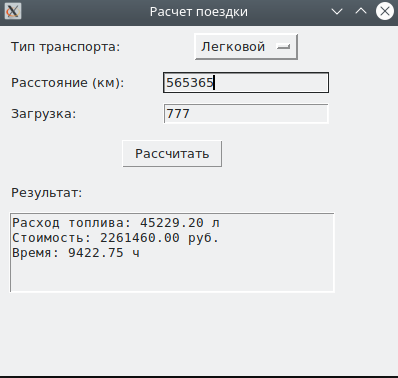

 # Задание
По своему варианту задания создайте пакет, содержащий 3 модуля, и подключите его к основной программе.
Основная программа должна предоставлять:
графический пользовательский интерфейс с возможностями ввода требуемых параметров и отображения результатов расчёта.
## Описание
Написала код для расчёта топлива автомобиля, в зависимости от загурзки, расчёт стоимости и времени поездки. Используя Фреймворк Tkinter.

## Скриншот

## Список литературы
[Руководство по Tkinter](https://metanit.com/python/tkinter/)
[chatgpt](https://chatgpt.com/)
